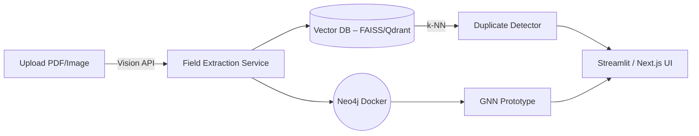

# MVP Plan – AI-Driven Invoice Auditing

## 1 Goal
Prove, in **<30 days / <$50 infrastructure burn**, that we can:
1. Auto-extract key fields from invoices/receipts with a hosted Vision LLM (OpenAI GPT-4o Vision or Google Gemini 1.5 Pro Vision).
2. Flag **duplicate invoices / payments** with vector similarity + business heuristics.
3. Demonstrate graph + compliance reasoning (Neo4j + mini-GNN) on a *toy* dataset to reassure enterprise buyers the design scales.

## 2 Scope & Non-Goals
✔ Extraction, deduplication, toy compliance demo, minimal UI
✘ Enterprise auth, large-scale ETL, SOC 2, Kubernetes, full clause catalogue

## 3 Architecture Snapshot

## 4 Technology Choices
| Layer | MVP Choice | Why | Future Path |
|-------|-----------|-----|-------------|
| Vision OCR/LLM | **OpenAI GPT-4o Vision** or **Gemini 1.5 Pro Vision** (API) | Zero infra, sub-second, better than self-host DeepSeek-VL | Swap for on-prem model when $$ ≈ $700/mo scale |
| Duplicate vectors | **Sentence-Transformers `all-MiniLM-L6-v2` + FAISS in-proc** | Runs CPU, 384 dims, free | Pinecone / Milvus cluster |
| Graph | **Neo4j-desktop Docker + ≤10k nodes** | 1-click local demo, Cypher familiar | AuraDB / self-host cluster |
| GNN demo | **PyG GraphSAGE on toy graph** | Runs CPU/GPU in minutes | Full hetero-GNN pipeline |
| UI | **Streamlit** (single page) | 1-day build | Next.js + Tailwind + Vercel |

## 5 Infra BOM (pay-as-you-go)
• Local dev box (Mac/PC/Linux with Docker & Python) for all services: FAISS, Neo4j, GNN demo, Streamlit UI.
• Vision API spend (OpenAI/Gemini) ≈ **$20** (for ~200 invoices).
• Optional: Local GPU (if available) for faster GNN demo training; CPU is sufficient for the toy GNN.
• Total infra cost (excl. dev box): Primarily Vision API spend.

## 6 Data Slice
• **200** RVL-CDIP invoices (class 11).  
• Synthetic duplicates (fuzzed amounts/dates) to label 40 duplicate pairs.  
• **20** CUAD contracts to populate clauses (only 5 clause types).

Let's create an ENV file also for secrets or is that in and included in our plan? ## 7 Sprint Plan (Detailed for AI-Assisted Development)

### Sprint 0 – Environment & Repo Setup (Est. 0.5 - 1 day)
  **Goal:** Prepare a clean, reproducible development environment.
  1.  **Project Initialization:**
      *   Task 0.1: Initialize Git repository.
      *   Task 0.2: Create a Python virtual environment (e.g., `venv`).
      *   Task 0.3: Generate `.gitignore` file (Python template).
  2.  **Dependency Management:**
      *   Task 0.4: Create `requirements.txt` file.
      *   Task 0.5: Add initial core dependencies to `requirements.txt`: `streamlit`, `pandas`, `requests`, `python-dotenv`.
  3.  **Docker Setup (Local Services):**
      *   Task 0.6: Create `docker-compose.yml` for Neo4j.
          *   Sub-task 0.6.1: Define Neo4j service, image (e.g., `neo4j:4.4`).
          *   Sub-task 0.6.2: Configure ports (7474, 7687).
          *   Sub-task 0.6.3: Set basic Neo4j authentication and memory limits.
      *   Task 0.7: Create `Dockerfile` for the main application (Streamlit/Flask).
          *   Sub-task 0.7.1: Base on `python:3.9-slim`.
          *   Sub-task 0.7.2: Copy `requirements.txt` and install dependencies.
          *   Sub-task 0.7.3: Set working directory and copy application code.
  4.  **Basic Application Structure:**
      *   Task 0.8: Create `app.py` (main Streamlit app file) with a "Hello World" title.
      *   Task 0.9: Create `src/` directory for modules.
      *   Task 0.10: Create `src/config.py` for API keys and settings (load from `.env`).
      *   Task 0.11: Create `.env.example` file listing required environment variables (e.g., `OPENAI_API_KEY`).
  5.  **Linting/Formatting (Optional but Recommended):**
      *   Task 0.12: Add `black` and `flake8` to `requirements.txt`.
      *   Task 0.13: Configure `pyproject.toml` or `setup.cfg` for linters.
      *   Task 0.14: Install Firebase CLI, init Firestore emulator, and configure `src/lib/firebase/firebase.ts` to connect to the local emulator in development.

### Sprint 1 – Vision API Integration & Data Extraction (Est. 3 - 4 days)
  **Goal:** Reliably extract structured data from invoices using an external Vision AI API.
  1.  **Vision API Client:**
      *   Task 1.1: In `src/vision_extractor.py`, create a function `extract_invoice_data(image_bytes, api_key)` to call OpenAI/Gemini Vision API.
          *   Sub-task 1.1.1: Handle API request (sending image and prompt).
          *   Sub-task 1.1.2: Define a clear prompt to extract: `invoice_no`, `date`, `vendor`, `total_amount`.
          *   Sub-task 1.1.3: Parse the API response (JSON) into a Python dictionary.
          *   Sub-task 1.1.4: Implement basic error handling for API calls (e.g., retries, status code checks).
  2.  **Data Loading & Preparation (RVL-CDIP):**
      *   Task 1.2: Create a script `scripts/load_rvl_cdip_samples.py` to download/access 200 sample invoice images from RVL-CDIP.
          *   Sub-task 1.2.1: If using `datasets` library, filter for invoice class.
          *   Sub-task 1.2.2: Save selected images to a local directory (e.g., `data/sample_invoices/`).
  3.  **Batch Processing Script:**
      *   Task 1.3: Create `scripts/batch_extract.py`.
          *   Sub-task 1.3.1: Read image files from `data/sample_invoices/`.
          *   Sub-task 1.3.2: For each image, call `extract_invoice_data()`.
          *   Sub-task 1.3.3: Store structured results (including filename) in a list of dictionaries.
          *   Sub-task 1.3.4: Save the list to `data/extracted_invoices.csv` using pandas.
          *   Sub-task 1.3.5: Implement basic logging for progress and errors.
  4.  **Unit Testing (Vision Extractor):**
      *   Task 1.4: Create `tests/test_vision_extractor.py`.
      *   Task 1.5: Write a unit test for `extract_invoice_data()` using a mock API call (or a single real call with a saved response for reproducibility).
          *   Sub-task 1.5.1: Test successful extraction and parsing.
          *   Sub-task 1.5.2: Test handling of a mock API error.

### Sprint 2 – Duplicate Detection with FAISS (Est. 3 - 4 days)
  **Goal:** Implement a local duplicate detection mechanism using vector embeddings.
  1.  **Text Embedding Generation:**
      *   Task 2.1: Add `sentence-transformers` and `faiss-cpu` (or `faiss-gpu` if local GPU available) to `requirements.txt`.
      *   Task 2.2: In `src/duplicate_detector.py`, create `invoice_to_text_representation(invoice_data_dict)` function.
          *   Sub-task 2.2.1: Concatenate key fields (vendor, amount, date elements) into a single string.
      *   Task 2.3: In `src/duplicate_detector.py`, create `get_embedding(text_string)` function using `sentence-transformers` (e.g., `all-MiniLM-L6-v2`).
  2.  **FAISS Index Management:**
      *   Task 2.4: In `src/duplicate_detector.py`, create `build_faiss_index(embeddings_list)`.
          *   Sub-task 2.4.1: Initialize FAISS index (e.g., `IndexFlatIP`).
          *   Sub-task 2.4.2: Normalize embeddings (if using cosine similarity with IP).
          *   Sub-task 2.4.3: Add embeddings to the index.
      *   Task 2.5: In `src/duplicate_detector.py`, create `search_faiss_index(index, query_embedding, top_k)`.
  3.  **Duplicate Detection Logic & API Endpoint:**
      *   Task 2.6: In `src/duplicate_detector.py`, create `find_potential_duplicates(invoice_id, all_invoices_data, faiss_index, embeddings_map)`.
          *   Sub-task 2.6.1: Get the embedding for the given `invoice_id`.
          *   Sub-task 2.6.2: Search FAISS for similar embeddings.
          *   Sub-task 2.6.3: Apply heuristic: `cosine_similarity > 0.9` AND `abs(amount_difference) < 1.0` AND `abs(date_difference_days) <= 7`.
          *   Sub-task 2.6.4: Return list of potential duplicate invoice IDs and their scores/details.
      *   Task 2.7: In `app.py` (or a separate Flask/FastAPI file if preferred later), create a simple API endpoint `/find_duplicates` that takes an `invoice_id` and uses the logic above.
          *   This will require loading `extracted_invoices.csv`, generating all embeddings, and building the FAISS index on startup or on-demand for the MVP.
  4.  **Evaluation Data & Script:**
      *   Task 2.8: Manually create/label `data/duplicate_pairs_ground_truth.csv` (40 pairs: `invoice_id_1, invoice_id_2, is_duplicate_flag`).
          *   Ensure some are from synthetic duplicates, some are true non-duplicates.
      *   Task 2.9: Create `scripts/evaluate_duplicates.py`.
          *   Sub-task 2.9.1: Load ground truth and `extracted_invoices.csv`.
          *   Sub-task 2.9.2: For each pair in ground truth, predict if duplicate using `find_potential_duplicates` logic.
          *   Sub-task 2.9.3: Calculate and print precision, recall, F1-score (target ≥ 85% accuracy/F1).

### Sprint 3 – Graph & Basic Compliance Demo (Est. 2 - 3 days)
  **Goal:** Demonstrate basic graph relationships and a simple compliance check using Neo4j and a toy GNN.
  1.  **Neo4j Data Loading:**
      *   Task 3.1: Add `py2neo` to `requirements.txt`.
      *   Task 3.2: Create `src/graph_manager.py`.
      *   Task 3.3: In `src/graph_manager.py`, function `connect_to_neo4j()`.
      *   Task 3.4: In `src/graph_manager.py`, function `clear_graph(graph)`.
      *   Task 3.5: In `src/graph_manager.py`, function `load_invoices_to_graph(graph, extracted_invoices_df)`.
          *   Sub-task 3.5.1: Create `(:Invoice)` nodes with properties.
          *   Sub-task 3.5.2: Create/merge `(:Vendor)` nodes.
          *   Sub-task 3.5.3: Create `[:ISSUED_BY]` relationships.
      *   Task 3.6: In `src/graph_manager.py`, function `load_contracts_to_graph(graph, contracts_df)`. (Use 20 sample CUAD contracts, define a simple `contracts.csv` structure: `contract_id, vendor_name, max_value, start_date, end_date`).
          *   Sub-task 3.6.1: Create `(:Contract)` nodes.
          *   Sub-task 3.6.2: Link to `(:Vendor)` nodes `[:HAS_CONTRACT]`.
      *   Task 3.7: Create `scripts/populate_neo4j.py` to call these loading functions.
  2.  **Basic Cypher Compliance Rule:**
      *   Task 3.8: In `src/graph_manager.py`, function `check_invoice_exceeds_contract(graph, invoice_id)`.
          *   Sub-task 3.8.1: Write Cypher query: `MATCH (i:Invoice {id: $invoice_id})-[:ISSUED_BY]->(:Vendor)<-[:HAS_CONTRACT]-(c:Contract) WHERE i.total_amount > c.max_value RETURN i, c`.
  3.  **Toy GNN Setup (PyG GraphSAGE):**
      *   Task 3.9: Add `torch` and `torch-geometric` to `requirements.txt`.
      *   Task 3.10: Create `src/gnn_compliance_model.py`.
      *   Task 3.11: Define `InvoiceGNN(torch.nn.Module)` class (2-layer GraphSAGE as previously discussed).
      *   Task 3.12: Function `export_data_for_gnn(graph)`: Query Neo4j to get nodes (Invoice, Contract, Vendor with basic features like amount, type) and edges (ISSUED_BY, HAS_CONTRACT) into PyG `Data` object.
          *   Sub-task 3.12.1: Create a binary label for invoices: `1` if it violates *any* contract rule (e.g., amount > contract.max_value for simplicity), `0` otherwise.
      *   Task 3.13: Function `train_gnn(model, data, epochs)`.
      *   Task 3.14: Function `predict_compliance_with_gnn(model, invoice_node_data, graph_data_pyg)`.
  4.  **GNN Training & Visualization Script:**
      *   Task 3.15: Create `scripts/train_gnn_demo.py`:
          *   Sub-task 3.15.1: Load data from Neo4j using `export_data_for_gnn`.
          *   Sub-task 3.15.2: Instantiate and train the GNN model.
          *   Sub-task 3.15.3: Print basic accuracy.
          *   Task 3.15.4: (Optional) Use `matplotlib` and `TSNE` from `sklearn.manifold` to plot node embeddings from GNN, colored by node type or compliance status. Save as `gnn_embeddings.png`.

### Sprint 4 – Streamlit UI & Demo Preparation (Est. 2 - 3 days)
  **Goal:** Create a simple interactive UI to demonstrate the core functionalities.
  1.  **Streamlit UI - File Upload & Extraction Display:**
      *   Task 4.1: In `app.py`, add `st.file_uploader` for PDF/image.
      *   Task 4.2: On upload, call `vision_extractor.extract_invoice_data()`.
      *   Task 4.3: Display extracted fields in a `st.table` or `st.json`.
  2.  **Streamlit UI - Duplicate Detection Display:**
      *   Task 4.4: After extraction, if an invoice ID is present, call the duplicate detection logic (from Sprint 2, possibly refactored to work directly with the extracted data and pre-built index).
      *   Task 4.5: If potential duplicates found, display them in a `st.warning` box, listing their IDs and similarity scores.
  3.  **Streamlit UI - Graph/Compliance Info Display:**
      *   Task 4.6: After extraction, connect to Neo4j.
      *   Task 4.7: Display a small, static image of the overall graph structure concept (can be pre-made).
      *   Task 4.8: For the uploaded invoice, run the Cypher compliance check (`check_invoice_exceeds_contract`). Display a `st.error` if it violates the rule.
      *   Task 4.9: (Stretch Goal) If GNN model is trained and saved, load it and try to predict compliance for the current invoice (might require creating a mini-graph on the fly or simplifying the GNN input for a single inference). Display GNN predicted probability.
  4.  **Final Demo Prep:**
      *   Task 4.10: Collect performance numbers (avg extraction time, duplicate check time).
      *   Task 4.11: Prepare a 5-slide pitch deck summarizing the MVP, demo flow, and findings.
      *   Task 4.12: Record a short demo video.

## 8 Deliverables (Granular for AI Tracking)

**Sprint 0 Deliverables:**
*   `0.1_git_repo_initialized.md` (confirmation)
*   `0.2_virtual_env_created.md` (confirmation)
*   `0.3_.gitignore` (file)
*   `0.4_requirements.txt` (file, initial version)
*   `0.6_docker-compose.yml` (file, for Neo4j)
*   `0.7_Dockerfile` (file, for app)
*   `0.8_app.py` (file, "Hello World")
*   `0.9_src_directory_created.md` (confirmation)
*   `0.10_src_config.py` (file)
*   `0.11_.env.example` (file)
*   `0.13_linter_config_file.md` (e.g., `pyproject.toml` section, if done)

**Sprint 1 Deliverables:**
*   `1.1_src_vision_extractor.py` (file, with `extract_invoice_data` function)
*   `1.2_scripts_load_rvl_cdip_samples.py` (file)
*   `1.2.2_data_sample_invoices_directory.md` (confirmation of images)
*   `1.3_scripts_batch_extract.py` (file)
*   `1.3.4_data_extracted_invoices.csv` (file, sample output)
*   `1.4_tests_test_vision_extractor.py` (file with unit tests)

**Sprint 2 Deliverables:**
*   Updated `0.4_requirements.txt` (with FAISS, sentence-transformers)
*   `2.2_src_duplicate_detector.py` (file, with core functions: `invoice_to_text_representation`, `get_embedding`, `build_faiss_index`, `search_faiss_index`, `find_potential_duplicates`)
*   Updated `0.8_app.py` (or separate API file with `/find_duplicates` endpoint implemented)
*   `2.8_data_duplicate_pairs_ground_truth.csv` (file)
*   `2.9_scripts_evaluate_duplicates.py` (file, with evaluation results printout/log)

**Sprint 3 Deliverables:**
*   Updated `0.4_requirements.txt` (with py2neo, torch, torch-geometric)
*   `3.2_src_graph_manager.py` (file, with Neo4j connection and loading functions)
*   `data/contracts.csv` (sample file for 20 contracts)
*   `3.7_scripts_populate_neo4j.py` (file)
*   `3.10_src_gnn_compliance_model.py` (file, with GNN class and helper functions)
*   `3.15_scripts_train_gnn_demo.py` (file)
*   `3.15.4_gnn_embeddings.png` (image, if generated)
*   `trained_gnn_model.pt` (saved PyTorch model, optional for MVP UI)

**Sprint 4 Deliverables:**
*   Updated `0.8_app.py` (Streamlit UI with all demo features)
*   `4.11_MVP_Demo_Deck.pptx` (or Google Slides link)
*   `4.12_MVP_Demo_Video.mp4` (or link)
*   Final `README.md` with updated setup and run instructions for the complete local demo.

## 9 Risks & Mitigations
| Risk | Likelihood | Impact | Mitigation |
|------|------------|--------|-----------|
| Vision API mis-parses | Med | Demo flop | Two-pass prompt + regex clean-up |
| Cosine false-pos | Med | Credibility | Add vendor fuzzy token ratio, amount threshold |
| Neo4j memory | Low | Minor | Limit to 10k nodes; desktop config |
| GNN training slow | Low | Minor | Use CPU – small graph |

## 10 Next After MVP
1. Swap FAISS → Pinecone, scale to 25k invoices.  
2. Expand clause catalogue, automate CUAD ingestion.  
3. Introduce Cognito auth + multi-tenant RBAC.  
4. Containerize micro-services, deploy on ECS/Fargate.  
5. Fine-tune Vision model on client invoice samples for >95 % field accuracy.
